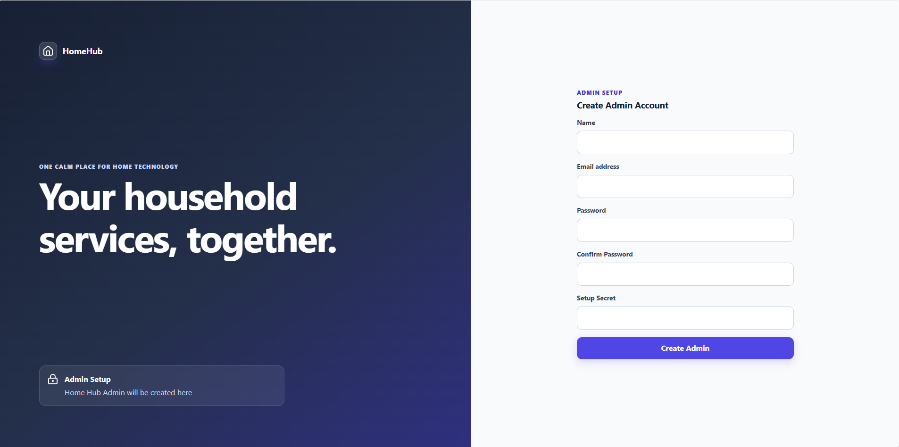
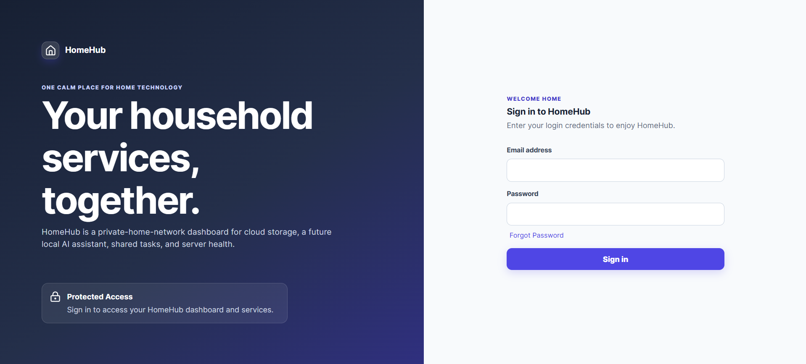
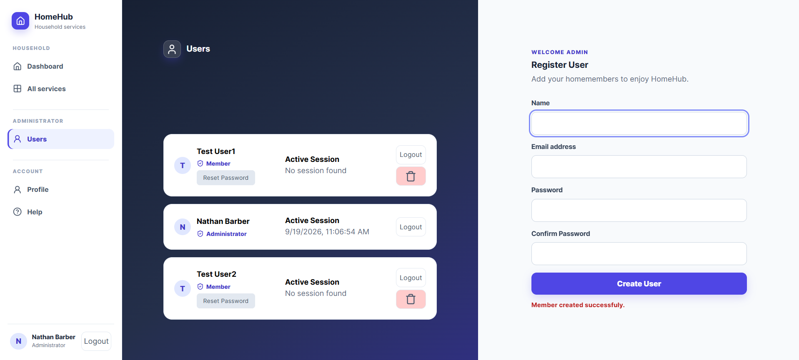
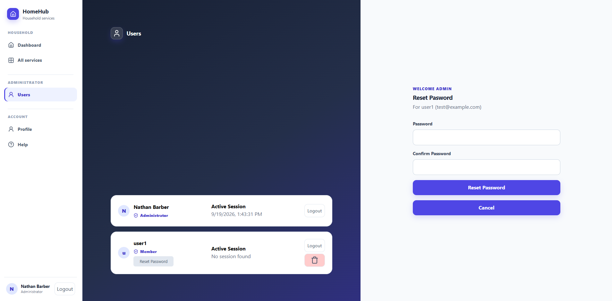
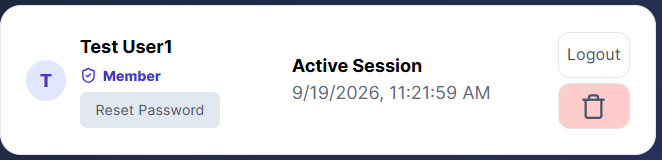
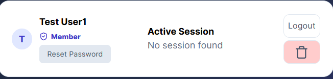
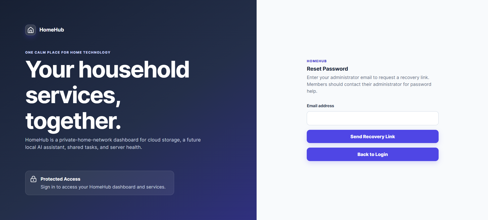

<link rel="stylesheet" href="./walkthrough.css">

<section class="hunt-walkthrough">
  

    
HomeHub Authentication Walkthrough

    <h3>Explore HomeHub authentication</h3>
    
HomeHub provides a one-time setup process for creating the initial administrator account. The administrator then creates and manages household member accounts.

  

  <article class="hunt-walkthrough__step">
    

      
01 / Admin Registration

      <h3>Open /setup to create the administrator</h3>
      
The /setup route opens the administrator registration page. HomeHub checks whether initial setup is available before displaying the form. After setup is complete, this route redirects to the login page.

      One-time administrator provisioning
    

    

      
    

  </article>

  <article class="hunt-walkthrough__step hunt-walkthrough__step--reverse">
    

      
02 / Login

      <h3>Log in for the first time</h3>
      
Log in as the administrator to manage your household members. A successful login creates a session that allows access to protected HomeHub routes. Administrator features also require the administrator role.

      Login and session creation
    

    

      
    

  </article>

  <article class="hunt-walkthrough__step">
    

      
03 / User Management

      <h3>Manage household member accounts</h3>
      
The administrator can create accounts for household members. Each member appears on an account card in the account management page. These cards show session information and provide controls for resetting passwords, ending sessions, and deleting accounts. Deleting an account requires confirmation.

      Account Creation
    

    

      
    

  </article>

   <article class="hunt-walkthrough__step hunt-walkthrough__step--reverse">
    

      
04 / Password Reset

      <h3>Reset member passwords</h3>
      
Only the HomeHub administrator can reset household members’ passwords. To reset a password, select the password reset option on the member’s account card and enter a new password.

      Password Reset
    

    

      
    

  </article>

  <article class="hunt-walkthrough__step">
    

      
05 / Session Management

      <h3>Manage user sessions remotely</h3>
      
Account cards display the creation time of each user’s most recent session, or indicate that no session was found. The administrator can revoke a user’s sessions remotely, requiring the user to sign in again to access protected resources.

      Sessions
    

    

      
      
    

  </article>

  <article class="hunt-walkthrough__step hunt-walkthrough__step--reverse">
    

      
06 / Admin Password Recovery

      <h3>Recover the administrator password by email</h3>
      
Administrator password recovery is available from the login page. Anyone can submit an email address, but recovery links are sent only to administrator accounts. The interface uses the same confirmation message regardless of whether the address belongs to an administrator, helping prevent account identification. HomeHub sends recovery emails through Gmail using Nodemailer.

      Password Recovery
    

    

      
    

  </article>
</section>